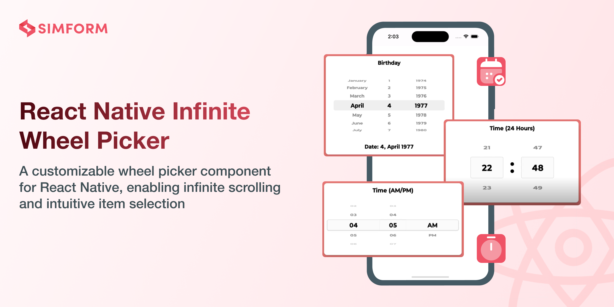
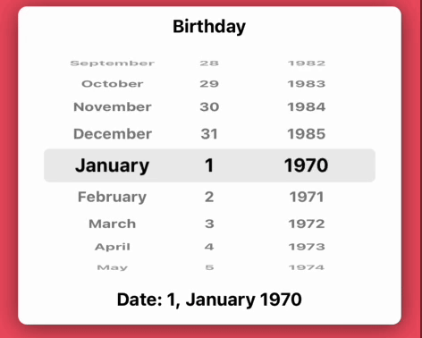
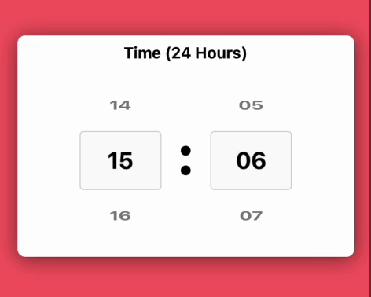
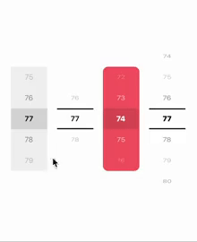

<!--  -->

# react-native-infinite-wheel-picker [](https://badge.fury.io/js/react-native-infinite-wheel-picker) [](https://www.android.com) [](https://developer.apple.com/ios) [](https://opensource.org/licenses/MIT)
The React Native Infinite Wheel Picker package offers a highly customizable, versatile, and seamless wheel picker component, enhancing the user experience with smooth scrolling and intuitive selection. Its dynamic design allows for endless scrolling, providing a natural and interactive interface for selecting values. 

The library is compatible with both Android and iOS platforms, offering a versatile solution to elevate your app's user interface with ease.

## 🎬 Preview

|    |       |       |


## Quick Access

[Installation](#installation) | [Usage and Examples](#usage) | [Properties](#properties) | [Example Code](#example) | [License](#license)

## Getting Started

Here's how to get started with react-native-infinite-wheel-picker in your React Native project:

### Installation

#### 1. Install the package

```sh
npm install react-native-infinite-wheel-picker
```

Using `Yarn`:

```sh
yarn add react-native-infinite-wheel-picker
```

##### 2. Install peer dependencies

```bash
$ npm install react-native-reanimated
# --- or ---
$ yarn add react-native-reanimated
```

##### 3. Install cocoapods in the ios project

```bash
cd ios && pod install
```

> Note: Make sure to add Reanimated's babel plugin to your `babel.config.js`

```
module.exports = {
      ...
      plugins: [
          ...
          'react-native-reanimated/plugin',
      ],
  };
```

## Usage

```jsx
import React from 'react';
import { StyleSheet, View } from 'react-native';
import { WheelPicker } from 'react-native-infinite-wheel-picker';

const App: React.FC = () => {
  const initialData = [1, 2, 3, 4, 5, 6, 7, 8];

  return (
    <View style={styles.container}>
      <WheelPicker
        initialSelectedItem={3}
        data={initialData}
        surroundingItemsCount={2}
        itemHeight={40}
        infinite={true}
        itemStyle={styles.itemStyle}
        onValueChange={value => {
          console.log(value);
        }}
        selectedItemContainerStyle={styles.selectedItemContainerStyle}
        wheelPickerContainerStyle={styles.containerStyle}
        selectedItemStyle={styles.selectedItemStyle}
        itemsAngle={[30, 40]}
        itemsOpacity={[0.5, 0.3]}
      />
    </View>
  );
};

export default App;

const styles = StyleSheet.create({
  container: {
    alignItems: 'center',
    flex: 1,
    justifyContent: 'center',
    backgroundColor: '#fff',
  },
  itemStyle: {
    fontSize: 15,
    color: '#000',
  },
  selectedItemContainerStyle: {
    backgroundColor: '#00000026',
    width: 80,
  },
  containerStyle: {
    backgroundColor: '#0000001a',
  },
  selectedItemStyle: {
    fontSize: 22,
  },
});
```

## 🎬 Preview


## Properties

| Props                 | Default |          Type           | Description |
| :-------------------- | :-----: | :---------------------: | :---------- |
| **data** |    -    |   string[] or number[] or { label: string or number, value: string or number }[]  | An array of strings or numbers or object representing the items to be displayed. eg1 [1, 2, 3, 4, 5, 6, 7, 8], eg2 [{label:'Item1', value:1}, {label:'Item2', value:2}] |
| **onValueChange** |  -   |  function  | A callback function invoked when the selected item changes, receiving the new value |
| infinite |    true    |         boolean          | A boolean that enables or disables infinite scrolling of the items |
| itemHeight |   60    | number | The height of each item in the picker, in pixels |
| surroundingItemsCount |    2    |       number        | The number of items to show above and below the selected item in the picker |
| itemStyle  |  -   |  TextStyle  | Style applied to the text of each item in the picker |
| selectedItemContainerStyle |  -   |  ViewStyle  | Style applied to the container of the selected item |
| wheelPickerContainerStyle     |    -    |   ViewStyle   | Style applied to the container of the wheel picker |
| initialSelectedItem |    -    | number or string | The item that should be pre-selected in the picker |
| selectedItemStyle  |    -    |   array   | Style applied to the text of the selected item |
| itemsAngle |    [40, 50]    |   array   | An array of angles for the rows of items above and below the selected item. For example, 40° will be applied to the first row above and below the selected item, while 50° will be applied to the second row above and below the selected item |
| itemsOpacity |    [0.6, 0.4]    |   array   | An array of opacities for the rows of items above and below the selected item. For example, 0.6 will be applied to the first row above and below the selected item, while 0.4 will be applied to the second row above and below the selected item |


## Example
  A full working example project is here [Example](./example/src/App.tsx)

```sh
yarn
yarn example ios   // For ios
yarn example android   // For Android
```


## Find this library useful? ❤️

Support it by joining [stargazers](https://github.com/SimformSolutionsPvtLtd/react-native-infinite-wheel-picker/stargazers) for this repository.⭐

## Bugs / Feature requests / Feedbacks

For bugs, feature requests, and discussion please use [GitHub Issues](https://github.com/SimformSolutionsPvtLtd/react-native-infinite-wheel-picker/issues/new?labels=bug&late=BUG_REPORT.md&title=%5BBUG%5D%3A), [GitHub New Feature](https://github.com/SimformSolutionsPvtLtd/react-native-infinite-wheel-picker/issues/new?labels=enhancement&late=FEATURE_REQUEST.md&title=%5BFEATURE%5D%3A), [GitHub Feedback](https://github.com/SimformSolutionsPvtLtd/react-native-infinite-wheel-picker/issues/new?labels=enhancement&late=FEATURE_REQUEST.md&title=%5BFEEDBACK%5D%3A)


## 🤝 How to Contribute

We'd love to have you improve this library or fix a problem 💪
Check out our [Contributing Guide](CONTRIBUTING.md) for ideas on contributing.

## Awesome Mobile Libraries

- Check out our other [available awesome mobile libraries](https://github.com/SimformSolutionsPvtLtd/Awesome-Mobile-Libraries)

## License

- [MIT License](./LICENSE)
