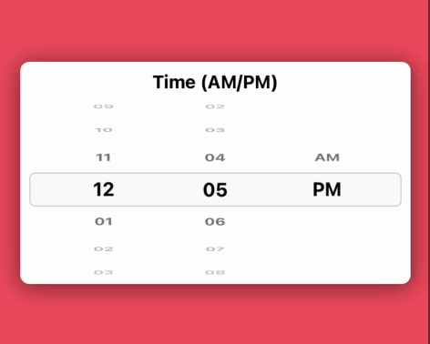

# react-native-infinite-wheel-picker 

[](https://www.npmjs.com/package/react-native-infinite-wheel-picker) [](https://www.npmtrends.com/react-native-infinite-wheel-picker) [](https://packagephobia.com/result?p=react-native-infinite-wheel-picker) [](https://www.android.com) [](https://developer.apple.com/ios) [](https://opensource.org/licenses/MIT)

---

The React Native Infinite Wheel Picker package offers a highly customizable, versatile, and seamless wheel picker component, enhancing the user experience with smooth scrolling and intuitive selection. It's dynamic design allows for endless scrolling, providing a natural and interactive interface for selecting values. 

The library is compatible with both Android and iOS platforms, offering a versatile solution to elevate your app's user interface with ease.

## 🎬 Preview

<table>
    <tr>
      <td><a href="https://github.com/SimformSolutionsPvtLtd/react-native-infinite-wheel-picker"></a></td>
      <td><a href="https://github.com/SimformSolutionsPvtLtd/react-native-infinite-wheel-picker"></a>
     </td>
     <td><a href="https://github.com/SimformSolutionsPvtLtd/react-native-infinite-wheel-picker"></a>
     </td>
    </tr>
</table>


## Quick Access

[Installation](#installation) | [Usage and Examples](#usage) | [Properties](#properties) | [Example Code](#example) | [License](#license)

## Getting Started

Here's how to get started with `react-native-infinite-wheel-picker` in your React Native project:

### Installation

#### Install the package

```sh
npm install react-native-infinite-wheel-picker
```

Using `Yarn`:

```sh
yarn add react-native-infinite-wheel-picker
```

## Usage

```jsx
import React from 'react';
import { StyleSheet, View } from 'react-native';
import { WheelPicker } from 'react-native-infinite-wheel-picker';

const App: React.FC = () => {
  const initialData = [1, 2, 3, 4, 5, 6, 7, 8];
  const [selectedIndex, setSelectedIndex] = React.useState(3);

  return (
    <View style={styles.container}>
      <WheelPicker
        initialSelectedIndex={3}
        data={initialData}
        restElements={2}
        elementHeight={30}
        onChangeValue={(index, value) => {
          console.log(value);
          setSelectedIndex(index);
        }}
        selectedIndex={selectedIndex}
        containerStyle={styles.containerStyle}
        selectedLayoutStyle={styles.selectedLayoutStyle}
        elementTextStyle={styles.elementTextStyle}
      />
    </View>
  );
};

export default App;

const styles = StyleSheet.create({
  container: {
    flex: 1,
    justifyContent: 'center',
    backgroundColor: '#fff',
    alignItems: 'center',
  },
  selectedLayoutStyle: {
    backgroundColor: '#00000026',
    borderRadius: 2,
  },
  containerStyle: { 
    backgroundColor: '#0000001a', 
    width: 150 
  },
  elementTextStyle: { 
    fontSize: 18 
  },
});
```

## 🎬 Preview

<table>
  <tr>
    <td><a href="https://github.com/SimformSolutionsPvtLtd/react-native-infinite-wheel-picker"></a></td>
  </tr>
</table>

For, a simple scroll use `infiniteScroll={false}` that disable infinite scrolling of the items.

```js
<WheelPicker
  initialSelectedIndex={3}
  data={initialData}
  restElements={2}
  elementHeight={30}
  onChangeValue={value => {
    console.log(value);
  }}
  infiniteScroll={false}
  selectedIndex={selectedIndex}
  containerStyle={styles.containerStyle}
  selectedLayoutStyle={styles.selectedLayoutStyle}
  elementTextStyle={styles.elementTextStyle}
/>;
```

## 🎬 Preview

<table>
  <tr>
    <td><a href="https://github.com/SimformSolutionsPvtLtd/react-native-infinite-wheel-picker"></a></td>
  </tr>
</table>

## Properties

| Props                 | Default |          Type           | Description |
| :-------------------- | :-----: | :---------------------: | :---------- |
| **data** |    -    |   `Array<string>` or `Array<number>` | An array of strings or numbers representing the items to be displayed. eg [1, 2, 3, 4, 5, 6, 7, 8] |
| **onChangeValue** |  -   |  function  | A callback function invoked when the selected item changes, receiving the new value |
| **selectedIndex** |  -   |  number  | The item that should be selected in the picker |
| initialSelectedIndex |    0    | number or string | The item that should be pre-selected in the picker |
| infiniteScroll |    true    |         boolean          | A boolean that enables or disables infinite scrolling of the items |
| restElements |    2    |       number        | The number of items to show above and below the selected item in the picker |
| loopCount |    100    |       number        | The number of array to repeat data in the picker |
| decelerationRate |    `'fast'`   |       `'normal', 'fast', 'number`        | The determines how quickly the scroll decelerates after the user lifts their finger in the picker |
| elementHeight |   40    | number | The height of each item in the picker, in pixels |
| elementTextStyle  |  -   |  `StyleProp<TextStyle>`  | Style applied to the text of each item in the picker |
| elementContainerStyle  |  -   |  `StyleProp<ViewStyle>`  | Style applied to the container of each item in the picker |
| selectedLayoutStyle |  -   |  `StyleProp<ViewStyle>`  | Style applied to the container of the selected item |
| containerStyle     |    -    |   `StyleProp<ViewStyle>`   | Style applied to the container of the wheel picker |
| containerProps     |    -    |   `ViewProps`   | Props applied to the container of the wheel picker |
| flatListProps     |    -    |   `FlatListProps`   | Props applied to the flatlist of the wheel picker |

##### Know more about [ViewProps](https://reactnative.dev/docs/view#props), [ViewStyle](https://reactnative.dev/docs/view-style-props), [FlatListProps](https://reactnative.dev/docs/flatlist#props), [TextStyle](https://reactnative.dev/docs/text-style-props#props), [decelerationRate](https://reactnative.dev/docs/scrollview#decelerationrate)

> Note: If any prop changing manually then recommended to reload the app to see the changes in component.

#### WheelPickerRef Methods

#### scrollToIndex()

```ts
scrollToIndex(index: number): void
```

`scrollToIndex` function that scroll to particular index.

## Example
  A full working example project is here [Example](./example/src/App.tsx)

```sh
yarn
yarn example ios   // For ios
yarn example android   // For Android
```

## Find this library useful? ❤️

Support it by joining [stargazers](https://github.com/SimformSolutionsPvtLtd/react-native-infinite-wheel-picker/stargazers) for this repository.⭐

## Bugs / Feature requests / Feedbacks

For bugs, feature requests, and discussion please use [GitHub Issues](https://github.com/SimformSolutionsPvtLtd/react-native-infinite-wheel-picker/issues/new?labels=bug&late=BUG_REPORT.md&title=%5BBUG%5D%3A), [GitHub New Feature](https://github.com/SimformSolutionsPvtLtd/react-native-infinite-wheel-picker/issues/new?labels=enhancement&late=FEATURE_REQUEST.md&title=%5BFEATURE%5D%3A), [GitHub Feedback](https://github.com/SimformSolutionsPvtLtd/react-native-infinite-wheel-picker/issues/new?labels=enhancement&late=FEATURE_REQUEST.md&title=%5BFEEDBACK%5D%3A)


## 🤝 How to Contribute

We'd love to have you improve this library or fix a problem 💪
Check out our [Contributing Guide](CONTRIBUTING.md) for ideas on contributing.

## Awesome Mobile Libraries

- Check out our other [available awesome mobile libraries](https://github.com/SimformSolutionsPvtLtd/Awesome-Mobile-Libraries)

## License

- [MIT License](./LICENSE)
